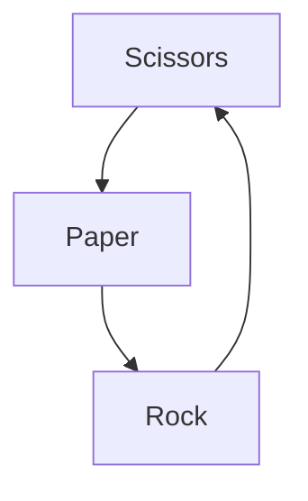

**ROCK,PAPER AND SCISSORS**

_Description_ : Rock paper scissors is a hand game usually played between two people, in which each player simultaneously forms one of three shapes with an outstretched hand. 

 **INTRODUCTION**:- 

- Rock paper scissors is a hand game usually played between two people, in which each player simultaneously forms one of three shapes with an outstretched hand. 

- These shapes are "rock" (a closed fist), "paper" (a flat hand), and "scissors" (a fist with the index finger and middle finger extended, forming a V). "Scissors" is i    identical to the two-fingered V sign (also indicating "victory" or "peace") except that it is pointed horizontally instead of being held upright in the air.

> **Rules**:- 

>  _Possible cases_:-

- if (player == rock) and (computer == paper); computer wins :tada:

- if (player == paper) and (computer == paper); tie

- if (player == scissors) and (computer == paper); player wins :tada:

- if (player == rock) and (computer == rock); tie

- if (player == paper) and (computer == rock); player wins :tada:

- if (player == scissors) and (computer == rock); computer wins :tada:

- if (player == rock) and (computer == scissors); player wins :tada:

- if (player == paper) and (computer == scissors); computer wins :tada:

- if (player == scissors) and (computer == scissors); tie
. 

> **Algorithm**:-

- [x] The computer will choose a random choice between "Rock", "Paper" and "Scissor". 

- [x] User Input will be taken.

- [x] Input will be compared with computers choice.

 - [x] According to rules, one of them will win.

> **Dependencies**:-

*Python langauge*

